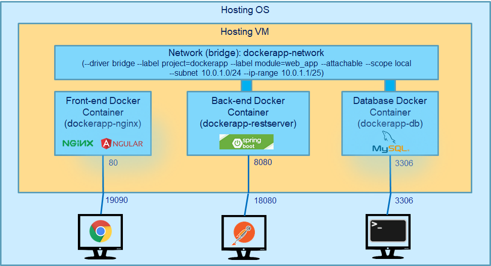

# DockerApp Demo

## Introduction

This repository is created for demonstrating how to build and deploy a typical fullstack project in the docker environment.

In this demon, we will setup two environments for two typical applications. Each environment contains a front-end application, back-end service (A REST API server), and a database server

* The first environment contains the following three components:
  * Front-end application: implemented using Angular framework
  * Backend REST API server: implemented using SpringBoot 2
  * Database server: implemented using MySQL 8.x
* The second environment contains the following three components:
  * Front-end application: implemented using Angular framework
  * Backend REST API server: implemented using SpringMVC that is deployed on Tomcat
  * Database server: implemented using MySQL 8.x

The following diagrams illustrate the two environments.


<figcaption align = "center"><b>Figure.1 - Angular-SpringBoot-MySQL Environment</b></figcaption>

&nbsp;


<figcaption align = "center"><b>Figure.2 - Angular-SpringMVC/Tomcat-MySQL Environment</b></figcaption>

## The Application

* Front-end application: implemented using Angular framework
* Backend REST API application #1: implemented using SpringBoot 2
* Backend REST API application #2: implemented using SpringMVC that is deployed on Tomcat
* Database server: implemented using MySQL 8.x

Free download from GitHub: https://github.com/cubic2008/DockerAppDemo

GIT clone/pull: https://github.com/cubic2008/DockerAppDemo.git

### The Frontend Application

* Developed using Angular Framework
* Implemented a simple CRUD functions
* Communicates to the backend REST API server


<figcaption align = "center"><b>Figure.3 - The Frontend Application</b></figcaption>

### The Back-end Application - SpringBoot

* Developed using SpringBoot Framework
* Expose a set of CRUD functions to front-end App
* Can be tested using Postman


<figcaption align = "center"><b>Figure.4 - The Backend Application (SpringBoot version) tested with Postman</b></figcaption>

### The Back-end Application - SpringMVC

* Developed using SpringMVC Framework
* Need to be deployed to App Server, e.g., Tomcat
* Expose a set of CRUD functions (functionalities are exact the same as in the SpringBoot version) to frontend App
* Can be tested using Postman


<figcaption align = "center"><b>Figure.5 - The Backend Application (SpringMVC version) tested with Postman</b></figcaption>

### The Database Server

* Use MySQL in this example.
* Can be replaced by any other relational database.

## Build and Run the Application Locally

In this section, we will describe how to build and run the application locally, i.e., without deploying docker environment.

You will need to have the following software installed locally.

* MySQL v8.x
* Maven
* JDK 8
* Node.js
* Angular
* Postman (optional)

### Setup and Deploy to the Database Server Locally

Before deploying on Docker, let’s see how to run the application locally.

Let setup and start the database first. First you need start the MySQL database engine.

In this example, the local host is running Windows O/S (hosting O/S)

**Step 1**: Get a clone copy from Github (using git clone or git pull command):

```powershell
C:> docker clone https://github.com/cubic2008/DockerAppDemo.git DockerApp
```

Step 2: Before running the local database setup script, you will need to set the “MYSQL_HOME” environment variable to point to the MySQL DB installation directory, for example:

```powershell
C:> SET MYSQL_HOME=C:\mysql-8.0.18-winx64
```

Step 3: Run local database setup under the “local” directory. The local setup script uses the MySQL “root” account, so you will have to input the password for the “root” account.

```powershell
C:> cd DockerApp\local
C:> setup_mysql_local.bat
```

Step 4: Now you can verify the database setup using the commands shown below.


<figcaption align = "center"><b>Figure.6 - Verify local MySQL database setup</b></figcaption>

Please note that the password specified in the local setup script is **“appPassw0rd”**. Feel free to change it as you wish.

The scripts for setting up MySQL database are shown below.


<figcaption align = "center"><b>Figure.7 - MySQL local setup script</b></figcaption>

### Build & Start the Backend REST Server (SpringBoot) Locally

Next, we will build and start the backend REST API server – SpringBoot.

Assume you have already get a local copy of the application in the previous step. Run the following script under the “local” folder to build and run the backend REST server of SpringBoot version.

```powershell
C:> cd DockerApp\local
C:> build_and_run_springboot_locally.bat
```

The "**build_and_run_springboot_locally.bat**" script consists of three steps (the script is shown below):

1. Setup the environment variables for connecting to the database server
2. Build the server using “maven package” command
3. Start the SpringBoot application which embedded a Tomcat server.

```powershell
@REM Step 1: Setup the environment variables for connecting to the database server
set DOCKERAPP_DB_HOST=localhost
set DOCKERAPP_DB_PORT=3306
set DOCKERAPP_DB_USER=appUser
set DOCKERAPP_DB_PASSWORD=appPassw0rd
set DOCKERAPP_DB_NAME=dockerappdb

@REM Step 2: Build the server using “maven package” command
cd "../DockerApp-Backend (SpringBoots)"
@REM mvn -Dmaven.test.skip package
call mvn package

@REM Step 3: Start the SpringBoot application which embedded a Tomcat server.
java -jar target/docker_app_backend-0.0.1-SNAPSHOT.jar
```
<figcaption align = "center"><b>Script.1 - build_and_run_springboot_locally.bat</b></figcaption>

After the backend REST API server starts, you can verify using Postman with the following REST operation:

```
GET http://localhost:8080/api/v1/products
```

<figcaption align = "center"><b>Figure.8 - Verify Springboot Server Locally</b></figcaption>

### Build & Run the Frontend Application Locally

Next, we will build and start the Frontend Application.

Assume you have already get a local copy of the application in the previous step.

In order to build and run the frontend application, you need to have node.js (npm) and Angular installed.

Run the following script under the “**local**” folder to build and run the Frontend Application.

```powershell
C:> cd DockerApp\local
C:> run_frontend_app.bat
```

The "**run_frontend_app.bat**" script consists of two steps (the script is shown below):

1. Download the required modules/libraries (using npm install command)
2. Start the Frontend Application (in development mode) (using ng serve command)

```powershell
@echo off

@REM Step 1: Download the required modules/libraries

echo +--------------------------------------------------------------------+
echo ^|              Download the required modules/libraries               ^|
echo +--------------------------------------------------------------------+

cd ../DockerApp-Frontend
call npm install

@REM Step 2: Start the Frontend Application (in development mode)

echo +--------------------------------------------------------------------+
echo ^|        Start the Frontend Application (in development mode)        ^|
echo +--------------------------------------------------------------------+

start ng serve
cd ../local
```
<figcaption align = "center"><b>Script.2 - run_frontend_app.bat</b></figcaption>

After the Frontend application starts, you can verify by addressing the following URL via the browser. 

```
http://localhost:4200/products
```

You should be able to see three products that we inserted into the database during the database setup step.

<figcaption align = "center"><b>Figure.9 - The Frontend Application (connecting to SpringBoot server) run locally</b></figcaption>

### Build & Start the Backend REST Server (SpringMVC/Tomcat) Locally

Alternatively, we can replace the backend REST API server – SpringBoot version with the SpringMVC/Tomcat version. 
The purpose of having two versions is to demonstrate the docker setup for a typical usage of a Tomcat server.

Although Tomcat server is included in the docker images, running the application locally requires you have a 
Tomcat server pre-installed.

Before build and run the Springmvc/Tomcat backend application, we need to set up the Tomcat and Maven for:

* Connectivity to MySQL database (in Tomcat)
* maven deployment to Tomcat (in both Tomcat and Maven)

To set up the connectivity to MySQL database for Tomcat server, do the following two tasks:
* Add the following fragment to the <TOMCAT_HOME>/conf/context.xml:

```xml
<Context>
    … …
    <Resource name="jdbc/dockerappdb" auth="Container" type="javax.sql.DataSource"
          maxTotal="100" maxIdle="30" maxWaitMillis="10000"
          username="root" password="" driverClassName="com.mysql.cj.jdbc.Driver"
          url="jdbc:mysql://localhost:3306/dockerappdb"/>
</Context>
```

* Setup the Tomcat admin access: in the <TOMCAT_HOME>/conf/tomcat-users.xml, make the following changes:

```xml
<tomcat-users … >
    … …
    <user username="tomcat" password="tomcat" roles="manager-gui,manager-script"/>
    … …
</tomcat-users>
```

To enable maven deployment to Tomcat: in the **<MAVEN_HOME>/conf/settings.xml** add the following fragment 
(besides adding “tomcat” manager access in the previous step):

```xml
<settings … >
  … …
  <servers>
    … …
    <server>
      <id>tomcat-admin</id>
      <username>tomcat</username>
      <password>tomcat</password>
    </server>
  </servers>
  … …
</settings>
```

Please start your tomcat server, if you haven’t done so. Assume your local tomcat server listens at the port 8080.

Also assume you have already get a local copy of the application in the previous step.

Run the following script under the “**local**” folder to build and run the backend REST server of SpringMVC/Tomcat 
version.

```powershell
C:> cd DockerApp\local
C:> build_and_run_springmvc_tomcat_locally.bat
```

The “**build_and_run_springboot_locally.bat**” script execute the build and deployment using a single maven 
command “**mvn package tomcat7:deploy**”. The script is shown below:

```powershell
@echo off

@REM Step 1: Build and Deploy DockerApp-Backend (SpringMVC)

cd "../DockerApp-Backend (SpringMVC)"
@REM mvn -Dmaven.test.skip package tomcat7:deploy
call mvn package tomcat7:deploy

cd ../local
```
<figcaption align = "center"><b>Script.3 - build_and_run_springmvc_tomcat_locally.bat</b></figcaption>

After the backend REST API server starts, you can verify using Postman with the following REST operation:

```
GET
http://localhost:18080/docker_app_backend/api/v1/products
```


<figcaption align = "center"><b>Figure.10 - Verify Tomcat Server Locally</b></figcaption>

### Point the Frontend App to connect to local SpringMVC/Tomcat

If you run the SpingMVC/Tomcat version as the backend REST API server, you need to revise the API url in Frontend App 
to make it connect to this backend REST API server. Revise the **DockerApp-Frontend\src\environments\environment.ts** 
as below:

```shell
… …
export const environment = {
  production: false,
  apiURL: 'http://localhost:8080/docker_app_backend'
};
… …
```

<figcaption align = "center"><b>environment.ts</b></figcaption>

Then run the following script under the “local” folder to build and run the Frontend Application. You should be able 
to verify by accessing the same URL of the frontend application.

```powershell
C:> cd DockerApp\local
C:> run_frontend_app.bat
```

## Build and Deploy the Application to the Docker Environment

Next we will describe how to build and deploy this application to a Docker Environment.

The diagram below illustrates the docker images that will be used or created in this process.


<figcaption align = "center"><b>Figure.11 - Docker Images</b></figcaption>

  <em>&lt;CourseDockerID&gt; will be provided in the class</em>

We will assume the hosting machine runs a Windows 10 OS, with an Ubuntu VM running on it (we call it hosting VM). 
Our docker containers will be deployed on this hosting VM.

### The base image

We will need a docker container for building applications:

* Need Git for checking out source code from GitHub
* Need Maven for building backend applications
* Need Node.js for building the frontend application

So we choose the following two images to meet these needs:

* **&lt;CourseDockerID&gt;/ubuntu-git-maven**: this image will be used as the base image for backend applications (both Git 
and Maven) and the database (Git). We will build this image ourselves.
* **node:latest**: this image will be used as the base image for building the frontend application (npm and ng)

### The base image - &lt;CourseDockerID&gt;/ubuntu-git-maven

The base image, **&lt;CourseDockerID&gt;/ubuntu-git-maven**, is built on the official “**ubuntu:latest**” image, with 
adding **git** and **maven**.

Below is the dockerfile, **docker/ubuntu-git-maven.dockerfile**, for building this image. 
The **docker/create_ubuntu-git-maven_image.sh** script contains the command for building the image and 
uploading/pushing to DockerHub. In later steps, we will not build the image every time, but download it 
directly from GitHub.

```dockerfile
FROM ubuntu:latest
ENV DEBIAN_FRONTEND=noninteractive 
RUN apt-get update 
RUN apt-get install -y git
RUN apt-get install -y maven
```

<figcaption align = "center"><b>Script.4 - ubuntu-git-maven.dockerfile</b></figcaption>

```shell
docker image build --tag <CourseDockerID>/ubuntu-git-maven 
       -f ubuntu-git-maven.dockerfile .
docker image push <CourseDockerID>/ubuntu-git-maven
```

<figcaption align = "center"><b>Script.5 - create_ubuntu-git-maven_image.sh</b></figcaption>

### Building the database image

The dockerfile (**docker/mysql.dockerfile**) is used for creating the MySQL database server. It consists of two steps:

Step 1: Use “**&lt;CourseDockerID&gt;/ubuntu-git-maven**” as the base image, and download the application from GitHub as 
“**build1**” image

* Run “**git clone**” command to download the application to **/home/DockerApp**

Step 2: Use the “**mysql:latest**” as the base image, and create the MySQL DB Server using the schema from "**build1**“ 
as “**runtime**” image.

* Copy "**/home/DockerApp/database/schema.sql**“ from build1 image to “**/docker-entrypoint-initdb.d**” on runtime image. 
This entrypoint file, which creates the database schema, will run each time when a container is created from the image 
and run for the first time.

* Setup the default value of the following environment variables that are required by the “**mysql:latest**” image 
(these environment variables could be overwritten when a container is create from this image. In our example, we 
leave them as defined here):
  * MYSQL_ROOT_PASSWORD=""
  * MYSQL_DATABASE="dockerappdb"
  * MYSQL_USER="appuser"
  * MYSQL_PASSWORD="appPassw0rd"
  * MYSQL_ALLOW_EMPTY_PASSWORD="yes"

```dockerfile
# This is the dockerfile that is used to create MySQL DB server

# Stage 1: Download the application from GitHub

FROM <CourseDockerID>/ubuntu-git-maven as build1

RUN cd /home && \
    git clone https://github.com/cubic2008/DockerAppDemo.git DockerApp

# Stage 2: Create the MySQL DB Server using the schema from "build1"

FROM mysql:latest as runtime
ARG src1="/home/DockerApp/database/schema.sql"
ARG target1=/docker-entrypoint-initdb.d
COPY --from=build1 ${src1} ${target1}
ENV MYSQL_ROOT_PASSWORD="" \
    MYSQL_DATABASE="dockerappdb" \
    MYSQL_USER="appuser" \
    MYSQL_PASSWORD="appPassw0rd" \
    MYSQL_ALLOW_EMPTY_PASSWORD="yes"
```

<figcaption align = "center"><b>Script.6 - mysql.dockerfile</b></figcaption>

&nbsp;

The following command will create the image named “**dockerapp-db**”, which is the step 1.2 of the build scripts 
“**docker/build_angular_springboot_mysql.sh**” and “**docker/build_angular_tomcat_mysql.sh**”.

```shell
docker image build --tag dockerapp-db -f mysql.dockerfile .
```

#### Building the Backend REST server (SpringBoot) image

The dockerfile (**docker/springboot.dockerfile**) is used for creating the Backend REST server (SpringBoot version). 
It consists of two steps:

Step 1: Use “**&lt;CourseDockerID&gt;/ubuntu-git-maven**” as the base image, and download the application from GitHub and 
build the executable package using Maven as “**build1**” image

* Run “**git clone**” command to download the application to **/home/DockerApp**
* Set the environment variables for connecting the database server that are used by the maven build to run test cases. 
This step can be skipped if maven build command skips the test (with **-Dmaven.test.skip** option) in the next sub-step. 
In order to run the test cases during the build, the database server container needs to be up running. This sub-step is 
currently commented out.
  * ENV DOCKERAPP_DB_HOST=dockerapp-db \\
    &nbsp;&nbsp;&nbsp;&nbsp;&nbsp;&nbsp;&nbsp;&nbsp;DOCKERAPP_DB_PORT=3306 \\
    &nbsp;&nbsp;&nbsp;&nbsp;&nbsp;&nbsp;&nbsp;&nbsp;DOCKERAPP_DB_NAME=dockerappdb \\
    &nbsp;&nbsp;&nbsp;&nbsp;&nbsp;&nbsp;&nbsp;&nbsp;DOCKERAPP_DB_USER=appuser \\
    &nbsp;&nbsp;&nbsp;&nbsp;&nbsp;&nbsp;&nbsp;&nbsp;DOCKERAPP_DB_PASSWORD=appPassw0rd
* Run “**mvn -Dmaven.test.skip package**” (or “**mvn package**” to run test cases, which requires connecting to the 
backend database)

Step 2: Use the “**ubuntu:latest**” as the base image to create the Backend REST Server (SpringBoot version) using the 
target package built in "**build1**“ as “**runtime**” image

* Install openjdk-8-jdk
* Copy the following to files from “**build1**” image to the “**/home**” directory of the “**runtime**” image:
  * /home/DockerApp/DockerApp-Backend (SpringBoots)/target/docker_app_backend-0.0.1-SNAPSHOT.jar**: this is the target 
  package built using “**mvn package**” command in the stage 1
  * /home/DockerApp/DockerApp-Backend (SpringBoots)/src/main/resources/application.properties**: this is optional. We 
  add this step to demonstrate the scenario where there is a need in the runtime environment to provide a specific 
  application.properties required SpringBoot.
* Set runtime environment variables that are required by the SpringBoot application. These environment variables are 
used in the application.properties file. This decouple the environment specific information from the application’s 
source code.
  * ENV DOCKERAPP_DB_HOST=dockerapp-db \\
    &nbsp;&nbsp;&nbsp;&nbsp;&nbsp;&nbsp;&nbsp;&nbsp;DOCKERAPP_DB_PORT=3306 \\
    &nbsp;&nbsp;&nbsp;&nbsp;&nbsp;&nbsp;&nbsp;&nbsp;DOCKERAPP_DB_NAME=dockerappdb \\
    &nbsp;&nbsp;&nbsp;&nbsp;&nbsp;&nbsp;&nbsp;&nbsp;DOCKERAPP_DB_USER=appuser \\
    &nbsp;&nbsp;&nbsp;&nbsp;&nbsp;&nbsp;&nbsp;&nbsp;DOCKERAPP_DB_PASSWORD=appPassw0rd

    ```properties
    server.port=8080
    spring.datasource.url=jdbc:mysql://${DOCKERAPP_DB_HOST}:${DOCKERAPP_DB_PORT}/${DOCKERAPP_DB_NAME}
    spring.datasource.username=${DOCKERAPP_DB_USER}
    spring.datasource.password=${DOCKERAPP_DB_PASSWORD}
    spring.jpa.hibernate.use-new-id-generator-mappings=false
    ```

    <figcaption align = "center"><b>Script.7 - application.properties</b></figcaption>

* Set the entrypoint in order for the container to run the following command at the start-up.
  * java –jar /home/docker_app_backend-0.0.1-SNAPSHOT.jar --spring.config.location=/home/application.properties

  Alternatively, we could just run the following command without specifying a dedicated **application.properties** file. 
  We use a provided “**application.properties**” file to demonstrate to let the application use an external configuration 
  file in the docker environment.
  * java –jar /home/docker_app_backend-0.0.1-SNAPSHOT.jar
* Expose port 8080 for REST API operations.

```dockerfile
# This is the dockerfile that is used to create the REST Server
# for running the DockerApp Backend (SpringBoot)

# Stage 1: Compile and Build the SpringBoot backend application

FROM davidgao2008/ubuntu-git-maven as build1

RUN cd home && \
    git clone https://github.com/cubic2008/DockerAppDemo.git DockerApp
# Set working directory
WORKDIR "/home/DockerApp/DockerApp-Backend (SpringBoots)"

# The environment variables for connecting to the database server that are required 
# when the maven build runs the test cases. In order to run the test cases during
# the build, the database server container needs to be up running. You also need to 
# specify the "--network dockerapp-network" option in the "docker image build" command.
# Also dont forget to set the following two environment variables on the hosting VM 
# before running the msyql database server container:
# *    export DB_USER=appuser
# *    export DB_PASSWORD=appPassw0rd
#ENV DOCKERAPP_DB_HOST=dockerapp-db \
#    DOCKERAPP_DB_PORT=3306 \
#    DOCKERAPP_DB_NAME=dockerappdb \
#    DOCKERAPP_DB_USER=appuser \
#    DOCKERAPP_DB_PASSWORD=appPassw0rd
#RUN mvn package

RUN mvn -Dmaven.test.skip package

# Stage 2: Prepare the target image

FROM ubuntu:latest as runtime
ENV DEBIAN_FRONTEND=noninteractive 
RUN apt-get update && \
    apt-get install -y openjdk-8-jdk
ARG src1="/home/DockerApp/DockerApp-Backend (SpringBoots)/target/docker_app_backend-0.0.1-SNAPSHOT.jar"
ARG target1=/home/docker_app_backend-0.0.1-SNAPSHOT.jar
ARG src2="/home/DockerApp/DockerApp-Backend (SpringBoots)/src/main/resources/application.properties"
ARG target2=/home/application.properties
COPY --from=build1 ${src1} ${target1}
COPY --from=build1 ${src2} ${target2}
ENV DOCKERAPP_DB_HOST=dockerapp-db \
    DOCKERAPP_DB_PORT=3306 \
    DOCKERAPP_DB_NAME=dockerappdb \
    DOCKERAPP_DB_USER=appUser \
    DOCKERAPP_DB_PASSWORD=appPassw0rd
#    DOCKERAPP_DB_JNDI_NAME=jdbc/dockerappdb
ENTRYPOINT ["java", "-jar", "/home/docker_app_backend-0.0.1-SNAPSHOT.jar", "--spring.config.location=/home/application.properties"]
#ENTRYPOINT ["java", "-jar", "/home/docker_app_backend-0.0.1-SNAPSHOT.jar"]
EXPOSE 8080
```

<figcaption align = "center"><b>Script.8 - springboot.dockerfile</b></figcaption>

&nbsp;

The following command will create the image named “**dockerapp-springboot**”, which is the step 1.1 of the 
“**docker/build_angular_springboot_mysql.sh**” script.

```shell
sudo docker image build --tag dockerapp-springboot -f sprintboot.dockerfile .
```

#### Building the Backend REST server (SpringMVC/Tomcat) image

The dockerfile (**docker/tomcat.dockerfile**) is used for creating the Backend REST server (SpringMVC/Tomcat version). 
It consists of two steps:

Step 1: Use “**&lt;CourseDockerID&gt;/ubuntu-git-maven**” as the base image, and download the application from GitHub and 
build the deployable package using Maven as “**build1**” image. This step is the same as in the Backend REST Server 
(SpringBoot) image build process (**springboot.dockerfile**)

* Run “**git clone**” command to download the application to /home/DockerApp
* Set the environment variables for connecting the database server that are used by the maven build to run test cases. 
This step can be skipped if maven build command skips the test (with **-Dmaven.test.skip** option) in the next sub-step. 
In order to run the test cases during the build, the database server container needs to be up running. This sub-step is 
currently commented out.
  * ENV DOCKERAPP_DB_HOST=dockerapp-db \\
    &nbsp;&nbsp;&nbsp;&nbsp;&nbsp;&nbsp;&nbsp;&nbsp;DOCKERAPP_DB_PORT=3306 \\
    &nbsp;&nbsp;&nbsp;&nbsp;&nbsp;&nbsp;&nbsp;&nbsp;DOCKERAPP_DB_NAME=dockerappdb \\
    &nbsp;&nbsp;&nbsp;&nbsp;&nbsp;&nbsp;&nbsp;&nbsp;DOCKERAPP_DB_USER=appuser \\
    &nbsp;&nbsp;&nbsp;&nbsp;&nbsp;&nbsp;&nbsp;&nbsp;DOCKERAPP_DB_PASSWORD=appPassw0rd

* Run “**mvn -Dmaven.test.skip package**” (or “**mvn package**” to run test cases, which requires connecting to the 
backend database).

Step 2: Use the “**tomcat:9.0.56-jdk8-openjdk-bullseye**” as the base image to create the Backend REST Server 
(SpringMVC/Tomcat version) using the target package built in "**build1**“ as “runtime” image.

* Copy the following to files from “**build1**” image to the “**runtime**” image:
  * Source: /home/DockerApp/DockerApp-Backend (SpringMVC)/target/docker_app_backend.war \
    Target: /usr/local/tomcat/webapps/docker_app_backend.war \
    This is the target deployable WAR file built using “mvn package” command in the stage 1
  * Source: /home/DockerApp/environments/tomcat/context.xml \
  Target: /usr/local/tomcat/conf/context.xml \
  This is the Tomcat configuration file that contains the JNDI settings for the backend application to connect to the database server.
  * Source: /home/DockerApp/environments/tomcat/setenv.sh \
  Target: /usr/local/tomcat/bin/setenv.sh \
  This is the Tomcat environment setup script which is called when Tomcat server starts up. This file passes the runtime environment variables that are setup in the next sub-step that are used by the context.xml that is copied in the previous sub-step. Please see the next slide for more details on how Tomcat server’s environment information is setup.
* Set runtime environment variables that are required by the SpringMVC application.
  * ENV DOCKERAPP_DB_HOST=dockerapp-db \\
    &nbsp;&nbsp;&nbsp;&nbsp;&nbsp;&nbsp;&nbsp;&nbsp;DOCKERAPP_DB_PORT=3306 \\
    &nbsp;&nbsp;&nbsp;&nbsp;&nbsp;&nbsp;&nbsp;&nbsp;DOCKERAPP_DB_NAME=dockerappdb \\
    &nbsp;&nbsp;&nbsp;&nbsp;&nbsp;&nbsp;&nbsp;&nbsp;DOCKERAPP_DB_USER=appuser \\
    &nbsp;&nbsp;&nbsp;&nbsp;&nbsp;&nbsp;&nbsp;&nbsp;DOCKERAPP_DB_PASSWORD=appPassw0rd \\
    &nbsp;&nbsp;&nbsp;&nbsp;&nbsp;&nbsp;&nbsp;&nbsp;DOCKERAPP_DB_JNDI_NAME=jdbc/dockerappdb
* Expose port 8080 for REST API operations.

In order to make the database connection information configurable and pass to the application, a few steps have been 
taken:

* The database connection information is specified via the docker OS environment variable. This is done using **ENV** 
commands in the dockerfile.
* Then they are passed to Tomcat as the JVM properties. This is done using the &lt;TOMCAT_HOME&gt;/bin/**setenv.sh**.
* The JNDI entry configured in the &lt;TOMCAT_HOME&gt;/conf/**context.xml** refernces these JVM properties.
* SpringMVC application accesses the database using JNDI entry.

The **context.xml** and **setenv.sh** files are provided under the environments/tomcat folder in the GitHub repository.

Please see the next slide that illustrate how database connectivity information is setup for the docker image creation.


<figcaption align = "center"><b>Figure.12 - Environment Parameters and Configuration for SpringMVC backend application running on Tomcat server</b></figcaption>

&nbsp;

```dockerfile
# This is the dockerfile that is used to create the REST Server
# for running the DockerApp Backend (SpringMVC/Tomcat)

# Stage 1: Compile and Build the SpringMVC/Tomcat backend application

FROM davidgao2008/ubuntu-git-maven as build1

RUN cd home && \
    git clone https://github.com/cubic2008/DockerAppDemo.git DockerApp
# Set working directory
WORKDIR "/home/DockerApp/DockerApp-Backend (SpringMVC)"

# The environment variables for connecting to the database server that are required 
# when the maven build runs the test cases. In order to run the test cases during
# the build, the database server container needs to be up running. You also need to 
# specify the "--network dockerapp-network" option in the "docker image build" command.
# Also dont forget to set the following two environment variables on the hosting VM 
# before running the msyql database server container:
# *    export DB_USER=appuser
# *    export DB_PASSWORD=appPassw0rd
#ENV DOCKERAPP_DB_HOST=dockerapp-db \
#    DOCKERAPP_DB_PORT=3306 \
#    DOCKERAPP_DB_NAME=dockerappdb \
#    DOCKERAPP_DB_USER=appuser \
#    DOCKERAPP_DB_PASSWORD=appPassw0rd
#RUN mvn package
RUN mvn -Dmaven.test.skip package

# Stage 2: Prepare the target image

FROM tomcat:9.0.56-jdk8-openjdk-bullseye as runtime
ARG src1="/home/DockerApp/DockerApp-Backend (SpringMVC)/target/docker_app_backend.war"
ARG target1=/usr/local/tomcat/webapps/
ARG src2="/home/DockerApp/environments/tomcat/context.xml"
ARG target2=/usr/local/tomcat/conf/
ARG src3="/home/DockerApp/environments/tomcat/setenv.sh"
ARG target3=/usr/local/tomcat/bin/
COPY --from=build1 ${src1} ${target1}
COPY --from=build1 ${src2} ${target2}
COPY --from=build1 ${src3} ${target3}
ENV DOCKERAPP_DB_HOST=dockerapp-db \
    DOCKERAPP_DB_PORT=3306 \
    DOCKERAPP_DB_NAME=dockerappdb \
    DOCKERAPP_DB_USER=appuser \
    DOCKERAPP_DB_PASSWORD=appPassw0rd \
    DOCKERAPP_DB_JNDI_NAME=jdbc/dockerappdb
EXPOSE 8080
```

<figcaption align = "center"><b>Script.9 - tomcat.dockerfile</b></figcaption>

&nbsp;

The following command will create the image named “**dockerapp-tomcat**”, which is the step 1.1 of the 
“**docker/build_angular_tomcat_mysql.sh**” script.

```shell
sudo docker image build --tag dockerapp-tomcat -f tomcat.dockerfile .
```

#### Building the Frontend Web Server (connecting to SpringBoot) image

The dockerfile (**docker/nginx_springboot.dockerfile**) is used for creating the Frontend web server (for connecting 
SpringBoot backend REST server). It consists of two steps:

Step 1: Use “**node:latest**” as the base image, and download the application from GitHub and build the production 
deployable package using Maven as “**build1**” image.

* Defines two docker arguments (**apiUrlHost** and **apiUrlPort**) that can be passed when creating the docker image.
* Defines two environments (**API_URL_HOST** and **API_URL_PORT**) that takes the above two docker arguments and are 
used to configure the environment that required by the Frontend Anguar application to connect the backend REST server.
* Run “**git clone**” command to download the application to **/usr/local/app/DockerApp**
* Set up the **environment.prod.ts** that is used for building the target production deployable package. This is done 
by running the **environments/frontend/set_env_springboot.sh** which creates/overwrites 
**/usr/local/app/DockerApp/DockerApp-Frontend/src/environments/environment.prod.ts**, which contains the environment 
variables that is passed in the previous steps and is packaged in the build process.

```shell
echo "export const environment = {
   apiURL: 'http://${API_URL_HOST}:${API_URL_PORT}',
   production: true,
};" > /usr/local/app/DockerApp/DockerApp-Frontend/src/environments/environment.prod.ts
```

<figcaption align = "center"><b>Script.10 - set_env_springboot.sh</b></figcaption>

* Install required modules/dependencies using “**npm install**” command.
* Generate the production build of the frontend application using “**npm run build --prod**” command.

Step 2: Use the “**nginx:latest**” as the base image to create the Frontend Web Server and deploy the target package 
built in "**build1**“ as “**runtime**” image.

* Copy all files under “**/usr/local/app/DockerApp/DockerApp-Frontend/dist/DockerApp-Frontend/**” directory in the 
“**build1**” image to the “**/usr/share/nginx/html**” directory of the “**runtime**” image. This is the generated 
deployment package built in the previous step.
* Copy “**/usr/local/app/DockerApp/environments/nginx/nginx.conf**” file from the “**build1**” image to the 
“**/etc/nginx/nginx.conf**” of the “**runtime**” image. This file contains (static) configuration of Nginx server.
* Expose port 80

The following command will create the image named “**dockerapp-nginx**”, which is the step 1.3 of the build scripts 
“**docker/build_angular_springboot_mysql.sh**” and “**docker/build_angular_tomcat_mysql.sh**”.

```shell
sudo docker image build --tag dockerapp-nginx --build-arg \
     apiUrlHost=$HOSTING_SERVER_NAME --build-arg \
     apiUrlPort=$APP_SERVER_PORT -f nginx_springboot.dockerfile .
```

```dockerfile
# This is the dockerfile that is used to create the Frontend Server (Nginx)
# for running the DockerApp Frontend App (Angular) to connect the 
# SpringBoot backend REST Server


# Stage 1: Compile and Build angular codebase

# Use official node image as the base image
FROM node:latest as build
ARG apiUrlHost
ARG apiUrlPort
ENV API_URL_HOST=${apiUrlHost} \
    API_URL_PORT=${apiUrlPort}
# Set the working directory
WORKDIR /usr/local/app
RUN git clone https://github.com/cubic2008/DockerAppDemo.git DockerApp
WORKDIR /usr/local/app/DockerApp/DockerApp-Frontend
ENV NODE_OPTIONS=--openssl-legacy-provider

# Create the environment.prod.ts before the build
RUN chmod +x /usr/local/app/DockerApp/environments/frontend/set_env_springboot.sh
RUN /usr/local/app/DockerApp/environments/frontend/set_env_springboot.sh

# Install all the dependencies
RUN npm install

# Generate the build of the application
RUN npm run build --prod


# Stage 2: Serve app with nginx server

# Use official nginx image as the base image
FROM nginx:latest
ARG src1="/usr/local/app/DockerApp/DockerApp-Frontend/dist/DockerApp-Frontend/"
ARG src2="/usr/local/app/DockerApp/environments/nginx/nginx.conf"
# Copy the build output to replace the default nginx contents.
COPY --from=build ${src1} /usr/share/nginx/html
COPY --from=build ${src2} /etc/nginx/nginx.conf

EXPOSE 80
```

<figcaption align = "center"><b>Script.11 - nginx_springboot.dockerfile</b></figcaption>

#### Building the Frontend Web Server (for SpringMVC/Tomcat) image

The docker image for the frontend application as part of the SpringMVC/Tomcat version is very similar to the 
SpringBoot version. The only two differences are:

* The dockerfile name is: **docker/nginx_tomcat.dockerfile**
* The dockerfile uses “**environments/frontend/set_env_tomcat.sh**” to create/overwrite environment.prod.ts file. 
It specifies a different URL of the REST API, which is the only difference from the Frontend application’s point 
of view.

```dockerfile
# This is the dockerfile that is used to create the Frontend Server (Nginx)
# for running the DockerApp Frontend App (Angular) to connect the 
# SpringMVC/Tomcat backend REST Server


# Stage 1: Compile and Build angular codebase

# Use official node image as the base image
FROM node:latest as build
ARG apiUrlHost
ARG apiUrlPort
ENV API_URL_HOST=${apiUrlHost} \
    API_URL_PORT=${apiUrlPort}
# Set the working directory
WORKDIR /usr/local/app
RUN git clone https://github.com/cubic2008/DockerAppDemo.git DockerApp
WORKDIR /usr/local/app/DockerApp/DockerApp-Frontend
ENV NODE_OPTIONS=--openssl-legacy-provider

# Create the environment.ts before the build
RUN chmod +x /usr/local/app/DockerApp/environments/frontend/set_env_tomcat.sh
RUN /usr/local/app/DockerApp/environments/frontend/set_env_tomcat.sh

# Install all the dependencies
RUN npm install

# Generate the build of the application
RUN npm run build --prod


# Stage 2: Serve app with nginx server

# Use official nginx image as the base image
FROM nginx:latest
ARG src1="/usr/local/app/DockerApp/DockerApp-Frontend/dist/DockerApp-Frontend/"
ARG src2="/usr/local/app/DockerApp/environments/nginx/nginx.conf"
# Copy the build output to replace the default nginx contents.
COPY --from=build ${src1} /usr/share/nginx/html
COPY --from=build ${src2} /etc/nginx/nginx.conf

EXPOSE 80
```

<figcaption align = "center"><b>Script.12 - nginx_tomcat.dockerfile</b></figcaption>

### Create docker network

We need to create a docker network for the Backend REST server to communicate to the database server without any 
network configuration at the hosting VM level.

The following command create a docker network named “**dockerapp-network**”. This is included in the step 2 of the 
build scripts “**docker/build_angular_springboot_mysql.sh**” and “**docker/build_angular_tomcat_mysql.sh**”.

```shell
docker network create --driver bridge --label project=dockerapp \
    --label module=web_app --attachable --scope local \
    --subnet 10.0.1.0/24 --ip-range 10.0.1.1/25 dockerapp-network
```

### Create docker containers

#### Create the Database Server container

The following command create a container named “**dockerapp-db**” for the database server using the image “**dockerapp-db**” 
create in the previous step. This is included in the step 3 of the build scripts “**docker/build_angular_springboot_mysql.sh**” 
and “**docker/build_angular_tomcat_mysql.sh**”.

```shell
docker run --rm --name dockerapp-db --network dockerapp-network \
   -e MYSQL_USER=$DB_USER -e MYSQL_PASSWORD=$DB_PASSWORD -d dockerapp-db
```

We could map the port **3306** from the docker container to the same port on hosting VM, so we can access the MySQL DB in 
the hosting VM and the hosting OS (the VM runs on the hosting OS, docker containers run on the hosting VM).

```shell
docker run --rm --name dockerapp-db --network dockerapp-network \
   -p 3306:3306 \
   -e MYSQL_USER=$DB_USER -e MYSQL_PASSWORD=$DB_PASSWORD -d dockerapp-db
```

In the above command, we specify the database user and password for the backend applications to access the database 
through **$DB_USER** and **$DB_PASSWORD**. These are environment variables must be specified prior to create the images 
and containers. These are included in the step 0 of the build scripts “**docker/build_angular_springboot_mysql.sh**” and 
“**docker/build_angular_tomcat_mysql.sh**”.

#### Create the Backend REST server (SpringBoot) container

The following command create a container named “**dockerapp-restserver**” for the database server using the image 
“**dockerapp-springboot**” create in the previous step. This is included in the step 4 of the build script 
“**docker/build_angular_springboot_mysql.sh**”.

```shell
docker run --rm --name dockerapp-restserver --network dockerapp-network \
    -p $APP_SERVER_PORT:8080 -e DOCKERAPP_DB_USER=$DB_USER \
    -e DOCKERAPP_DB_PASSWORD=$DB_PASSWORD -d dockerapp-springboot
```

In the above command, we map the docker container port **8080** to **$APP_SERVER_PORT** (for exposing REST API, also used 
by the frontend container), and specify the database user and password for the application to access the database 
through **$DB_USER** and **$DB_PASSWORD**. These are environment variables must be specified prior to create the images 
and containers. These are included in the step 0 of the build scripts “**docker/build_angular_springboot_mysql.sh**” 
and “**docker/build_angular_tomcat_mysql.sh**”.

#### Create the Backend REST server (SpringMVC/Tomcat) container

The following command create a container named “**dockerapp-tomcat**” for the database server using the image 
“**dockerapp-tomcat**” create in the previous step. This is included in the step 4 of the build script 
“**docker/build_angular_tomcat_mysql.sh**”.

```shell
docker run --rm --name dockerapp-tomcat --network dockerapp-network \
    -p $APP_SERVER_PORT:8080 -e DOCKERAPP_DB_USER=$DB_USER \
    -e DOCKERAPP_DB_PASSWORD=$DB_PASSWORD -d dockerapp-tomcat
```

In the above command, we map the docker container port **8080** to **$APP_SERVER_PORT** (for exposing REST API, also used 
by the frontend container), and specify the database user and password for the application to access the database 
through **$DB_USER** and **$DB_PASSWORD**. These are environment variables must be specified prior to create the images 
and containers. These are included in the step 0 of the build scripts “**docker/build_angular_springboot_mysql.sh**” 
and “**docker/build_angular_tomcat_mysql.sh**”.

#### Create the Frontend Web Server container

The following command create a container named “**dockerapp-nginx**” for the database server using the image 
“**dockerapp-nginx**” create in the previous step. This is included in the step 4 of the build scripts 
“**docker/build_angular_springboot_mysql.sh**” and “**docker/build_angular_tomcat_mysql.sh**”.

```shell
docker run --rm --name dockerapp-nginx -p 19090:80 -d dockerapp-nginx
```

In the above command, we expose the docker container port **80** to the port **19090** on hosting VM, so we can access 
the application using the **http://localhost:19090** on the hosting VM and **<u>http://<hosting-ip-address>:19090</u>** 
on the hosting OS (please note that the VM runs on the hosting OS, docker containers run on the hosting VM,
&lt;hosting-ip-address&gt; is the IP address of the VM on the hosting OS’ network).

## Docker Compose

We also prepared four docker compose files that will create and run all three containers and a docker network as a 
service.

* **docker-compose_angular_springboot_mysql.yml**: will create and run all three containers and a docker network as a
service for the Nginx-SpringBoot-MySQL version. It does not create images. So it expects all images are previously created.
* **docker-compose_angular_tomcat_mysql.yml**: will create and run all three containers and a docker network as a 
service for the Nginx-SpringMVC/Tomcat-MySQL version. It does not create images. So it expects all images are previously 
created.
* **docker-compose_angular_springboot_mysql_with_image_build.yml**: will create and run all three containers and a docker 
network as a service for the Nginx-SpringBoot-MySQL version. It will create all required images per specified dockerfile 
in the docker compose YMAL file.
* **docker-compose_angular_tomcat_mysql_with_image_build.yml**: will create and run all three containers and a docker 
network as a service for the Nginx-SpringMVC/Tomcat-MySQL version. It will create all required images per specified 
dockerfile in the docker compose YMAL file.

### Docker Compose – without images build

To run the docker compose without image build, use the following commands for both versions respectively.

```shell
docker compose –f docker-compose_angular_springboot_mysql.yml up
```

```shell
docker compose –f docker-compose_angular_tomcat_mysql.yml up
```

The following screenshot shows the result.

<figcaption align = "center"><b>Figure.13 - Run "docker compose up" for the docker-compose files without image building</b></figcaption>

&nbsp;

The following are the two docker compose files for both Springboot and SpringMVC/Tomcat versions. It specifies the 
image names that expects the images need to be built prior to the docker compose command runs.

```dockerfile
version: "3.7"
networks:
  dockerapp-network:
    driver: bridge
    labels:
      project: "dockerapp"
      module: "web_app"
    attachable: true
services:
  dockerapp-db:
    image: "dockerapp-db"
    networks:
      - dockerapp-network
    environment:
      MYSQL_USER: appuser
      MYSQL_PASSWORD: appPassw0rd
    ports:
      - "3306:3306"
    deploy:
      replicas: 1
  dockerapp-nginx:
    image: "dockerapp-nginx"
    ports: 
      - "19090:80"
    deploy:
      replicas: 1
  dockerapp-restserver :
    image: "dockerapp-springboot"
    networks:
      - dockerapp-network
    ports:
      - "18080:8080"
    environment:
      DOCKERAPP_DB_USER: appuser
      DOCKERAPP_DB_PASSWORD: appPassw0rd
    depends_on:
      - dockerapp-db
    restart: on-failure
    deploy:
      replicas: 1
```

<figcaption align = "center"><b>Script.13 - docker-compose_angular_springboot_mysql.yml</b></figcaption>

&nbsp;

```dockerfile
version: "3.7"
networks:
  dockerapp-network:
    driver: bridge
    labels:
      project: "dockerapp"
      module: "web_app"
    attachable: true
services:
  dockerapp-db:
    image: "dockerapp-db"
    networks:
      - dockerapp-network
    environment:
      MYSQL_USER: appuser
      MYSQL_PASSWORD: appPassw0rd
    ports:
      - "3306:3306"
    deploy:
      replicas: 1
  dockerapp-nginx:
    image: "dockerapp-nginx"
    ports: 
      - "19090:80"
    deploy:
      replicas: 1
  dockerapp-restserver :
    image: "dockerapp-tomcat"
    networks:
      - dockerapp-network
    ports:
      - "18080:8080"
    environment:
      DOCKERAPP_DB_USER: appuser
      DOCKERAPP_DB_PASSWORD: appPassw0rd
    depends_on:
      - dockerapp-db
    restart: on-failure
    deploy:
      replicas: 1
```

<figcaption align = "center"><b>Script.14 - docker-compose_angular_tomcat_mysql.yml</b></figcaption>

### Docker Compose – with images build

To run the docker compose with image build, use the following commands for both versions respectively.

```shell
docker compose --env-file env.txt \
  –f docker-compose_angular_springboot_mysql_with_image_build.yml up
```

```shell
docker compose --env-file env.txt \
  –f docker-compose_angular_tomcat_mysql_with_image_build.yml up
```

The following screenshot shows the result.

<figcaption align = "center"><b>Figure.14 - Run "docker compose up" for the docker-compose files with image building</b></figcaption>

&nbsp;

The following are the docker compose files for both SpringBoot and SpringMVC/Tomcat versions. It specifies the 
dockerfiles. It will build the images as part of the docker compose up command.

```dockerfile
version: "3.7"
networks:
  dockerapp-network:
    driver: bridge
    labels:
      project: "dockerapp"
      module: "web_app"
    attachable: true
services:
  dockerapp-db:
    # image: "dockerapp-db"
    build:
      context: .
      dockerfile: mysql.dockerfile
    networks:
      - dockerapp-network
    environment:
      MYSQL_USER: appuser
      MYSQL_PASSWORD: appPassw0rd
    ports:
      - "3306:3306"
    deploy:
      replicas: 1
  dockerapp-nginx:
    # image: "dockerapp-nginx"
    build:
      context: .
      dockerfile: nginx_springboot.dockerfile
      args:
        apiUrlHost: ${HOSTING_SERVER_NAME}
        apiUrlPort: ${APP_SERVER_PORT}
    ports: 
      - "19090:80"
    deploy:
      replicas: 1
  dockerapp-restserver :
    # image: "dockerapp-springboot"
    build:
      context: .
      dockerfile: springboot.dockerfile
    networks:
      - dockerapp-network
    ports:
      - "18080:8080"
    environment:
      DOCKERAPP_DB_USER: appuser
      DOCKERAPP_DB_PASSWORD: appPassw0rd
    depends_on:
      - dockerapp-db
    restart: on-failure
    deploy:
      replicas: 1
```

<figcaption align = "center"><b>Script.15 - docker-compose_angular_springboot_mysql_with_image_build.yml</b></figcaption>

&nbsp;

```dockerfile
version: "3.7"
networks:
  dockerapp-network:
    driver: bridge
    labels:
      project: "dockerapp"
      module: "web_app"
    attachable: true
services:
  dockerapp-db:
    # image: "dockerapp-db"
    build:
      context: .
      dockerfile: mysql.dockerfile
    networks:
      - dockerapp-network
    environment:
      MYSQL_USER: appuser
      MYSQL_PASSWORD: appPassw0rd
    ports:
      - "3306:3306"
    deploy:
      replicas: 1
  dockerapp-nginx:
    # image: "dockerapp-nginx"
    build:
      context: .
      dockerfile: nginx_tomcat.dockerfile
      args:
        apiUrlHost: ${HOSTING_SERVER_NAME}
        apiUrlPort: ${APP_SERVER_PORT}
    ports: 
      - "19090:80"
    deploy:
      replicas: 1
  dockerapp-restserver :
    # image: "dockerapp-tomcat"
    build:
      context: .
      dockerfile: tomcat.dockerfile
    networks:
      - dockerapp-network
    ports:
      - "18080:8080"
    environment:
      DOCKERAPP_DB_USER: appuser
      DOCKERAPP_DB_PASSWORD: appPassw0rd
    depends_on:
      - dockerapp-db
    restart: on-failure
    deploy:
      replicas: 1
```

<figcaption align = "center"><b>Script.16 - docker-compose_angular_tomcat_mysql_with_image_build.yml</b></figcaption>

&nbsp;

It specifies the two build-args to take the value from two environment variables. The environment variables are stored 
in the **env.txt**, and is passed to the docker compose command through the **--env-files** option.

Below is the content of the **env.txt** file.

```properties
HOSTING_SERVER_NAME=192.168.15.135
APP_SERVER_PORT=18080
```

<figcaption align = "center"><b>Script.17 - env.txt</b></figcaption>

### Docker Compose – Check the status

You can use the following command to check the service status.

```shell
docker compose –f <docker-compose-file-name.yml> ps
```


<figcaption align = "center"><b>Figure.15 - Run "docker compose ps" to check the status of services</b></figcaption>

### Docker Compose – stop/remove services

You can use the following command to stop and remove the service

```shell
docker compose –f <docker-compose-file-name.yml> down
```


<figcaption align = "center"><b>Figure.16 - Run "docker compose stop" to stop and remove services</b></figcaption>

### Docker Compose Utility

We also created a utility script to help running the docker compose command: dockerapp-compose.sh. Below are usage:

```shell
./dockerapp-compose.sh [springboot|tomcat] [build|no-build] [up|down|ps]
```

The first and second arguments indicate which docker compose file will be used:

* **springboot** **build**: docker-compose_angular_springboot_mysql_with_image_build.ym
* **springboot** **no-build**: docker-compose_angular_springboot_mysql.yml
* **tomcat** **build**: docker-compose_angular_tomcat_mysql_with_image_build.yml
* **tomcat** **non-build**: docker-compose_angular_tomcat_mysql.yml

* The third argument specifies the docker-compose commands: **up**, **down** or **ps**

Below is the content of the dockerapp-compose.sh:

```bash
usage() {
    echo "Invalid arguments!"
    echo .
    echo "Usage: "
    echo "   ./dockerapp-compose.sh [springboot|tomcat] [build|no-build] [up|down|ps] "
    echo .
}
if [[ "$1" == "springboot" ]]
then
    if [[ "$2" == "build" ]]
    then
        composeFile="docker-compose_angular_springboot_mysql_with_image_build.yml"
    elif [[ "$2" == "no-build" ]]
    then
       composeFile="docker-compose_angular_springboot_mysql.yml"
    else
        usage
        # exit 1
    fi
elif [[ "$1" == "tomcat" ]]
then
    if [[ "$2" == "build" ]]
    then
       composeFile="docker-compose_angular_tomcat_mysql_with_image_build.yml"
    elif [[ "$2" == "no-build" ]]
    then
       composeFile="docker-compose_angular_tomcat_mysql.yml"
    else
        usage
        exit 1
    fi
else
    usage
    exit 1
fi
if [[ "$3" != "up" && "$3" != "down" && "$3" != "ps" ]]; then
    usage
    exit 1
fi
docker compose --env-file env.txt -f $composeFile $3 &
```

<figcaption align = "center"><b>Script.18 - dockerapp-compose.sh</b></figcaption>
